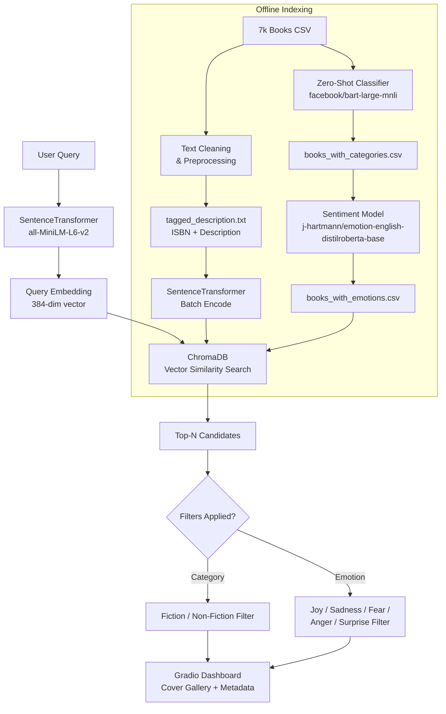

# 📖 Semantic Book Recommender

> **Live Demo →** [huggingface.co/spaces/hersheys21/semantic-book-recommender](https://huggingface.co/spaces/hersheys21/semantic-book-recommender)
> 
> **GitHub →** [github.com/harshiniramasamy5-star/semantic-book-recommender](https://github.com/harshiniramasamy5-star/semantic-book-recommender)

A semantic book recommendation engine built on top of the [freeCodeCamp LLM course](https://youtu.be/Q7mS1VHm3Yw) — extended with a custom-themed Gradio interface, a local sentence-transformer embedding model, and a rigorous offline evaluation harness measuring Precision@K and Recall@K.

Describe the kind of story you want — *"a redemption story set against war"* or *"a joyful coming-of-age adventure"* — and the system finds the most semantically similar books from a 7,000-book dataset, filterable by category and emotional tone.

---

## 🗂️ Table of Contents

1. [What This Project Does](#what-this-project-does)
2. [Architecture](#architecture)
3. [Data Pipeline](#data-pipeline)
4. [How Semantic Search Works](#how-semantic-search-works)
5. [Zero-Shot Classification](#zero-shot-classification)
6. [Sentiment Analysis & Emotional Tone](#sentiment-analysis--emotional-tone)
7. [Vector Database](#vector-database)
8. [Gradio Interface](#gradio-interface)
9. [Evaluation — Precision@K & Recall@K](#evaluation--precisionk--recallk)
10. [Tech Stack](#tech-stack)
11. [Project Structure](#project-structure)
12. [Running Locally](#running-locally)
13. [What I Built Beyond the Tutorial](#what-i-built-beyond-the-tutorial)
14. [Key Concepts Explained](#key-concepts-explained)

---

## What This Project Does

Traditional book recommendation systems rely on ratings, purchase history, or exact keyword matching. This system uses **semantic search** — it understands the *meaning* of your query by converting text into high-dimensional numerical vectors (embeddings), then finding books whose descriptions are closest in vector space.

| Feature | How it works |
|---|---|
| Natural language query | Sentence-transformer encodes your text into a 384-dim vector |
| Semantic similarity | Cosine similarity in ChromaDB finds nearest book embeddings |
| Category filter | Zero-shot classification labels every book Fiction / Non-Fiction |
| Emotional tone filter | Fine-tuned sentiment model scores each book on 5 emotions |
| Results display | Gradio gallery shows cover images, titles, authors, descriptions |

---

## Architecture



---

## Data Pipeline

The project uses the [7k Books with Metadata dataset from Kaggle](https://www.kaggle.com/datasets/dylanjcastillo/7k-books-with-metadata).

### Step 1 — Data Cleaning (`data-exploration.ipynb`)

Raw data is messy. The following cleaning steps were applied:

- **Missing values**: rows with missing `description`, `num_pages`, `average_rating`, `published_year`, or `ratings_count` are dropped — these fields are essential for meaningful recommendations.
- **Short descriptions**: books with fewer than 30 words in their description are removed. Semantic search needs enough text to produce a meaningful embedding; a 5-word blurb gives nothing for the model to work with.
- **Title normalisation**: `title_and_subtitle` column created — if a subtitle exists, it is appended (e.g., *"The Great Gatsby: A Novel"*); otherwise the title alone is kept.
- **Tagged descriptions**: a `tagged_description` column is created by prepending each book's ISBN13 to its description (format: `ISBN13_XXXXXXXXX <description text>`). This lets the vector store retrieve the right book record from search results.

### Step 2 — Zero-Shot Classification (genre labelling)

Books in the wild have inconsistent or missing genre labels. Instead of manual labelling, a **zero-shot classifier** automatically categorises every book as Fiction or Non-Fiction without any labelled training data.

Model used: `facebook/bart-large-mnli` via HuggingFace Transformers.

How it works: BART is a sequence-to-sequence model pre-trained on natural language inference (NLI). Zero-shot classification repurposes NLI — it asks "does this description *entail* the label Fiction?" and uses the entailment score as a confidence. The label with the highest score wins. No fine-tuning needed.

Result saved as `books_with_categories.csv`.

### Step 3 — Sentiment / Emotion Analysis

To allow emotional tone filtering, a fine-tuned emotion classifier scores every book description across **five emotions**: joy, sadness, fear, anger, and surprise.

Model used: `j-hartmann/emotion-english-distilroberta-base` — a DistilRoBERTa model fine-tuned on emotion datasets.

Each book gets a score for each emotion (0.0–1.0). The dominant emotion determines the book's primary emotional tone. Users can filter by tone — e.g., selecting "Joyful" surfaces books where joy is the dominant emotion.

Result saved as `books_with_emotions.csv` (this file is the final dataset used by the Gradio app).

---

## How Semantic Search Works

### Embeddings

A sentence-transformer converts text into a fixed-length numerical vector. Words with similar meanings land near each other in vector space — so "a dark detective mystery" and "a noir crime thriller" will produce similar vectors even though they share no words.

Model used: `all-MiniLM-L6-v2` (HuggingFace sentence-transformers library).

- **Input**: a sentence or paragraph of text
- **Output**: a 384-dimensional vector (a list of 384 floating-point numbers)
- **Why this model**: small (80 MB), fast, runs entirely locally — no API key or internet connection needed at inference time. Achieves strong performance on semantic similarity benchmarks for its size.

All book descriptions are encoded offline and stored in ChromaDB. At query time, the user's input is encoded with the same model, and the database returns the N nearest stored vectors.

### Similarity Metric

ChromaDB uses **cosine similarity** — it measures the angle between two vectors, not their absolute distance. Two vectors pointing in the same direction (angle ≈ 0) score 1.0 regardless of their magnitudes. This works well for semantic meaning because the *direction* a sentence-transformer assigns to text captures its semantic content.

---

## Zero-Shot Classification

**What it is**: classifying text into categories the model was never explicitly trained on, by using natural language as the label.

**How it was used here**: instead of training a genre classifier from scratch (which would require thousands of labelled examples), the pipeline passes each book description to `facebook/bart-large-mnli` with candidate labels `["fiction", "nonfiction"]`. The model returns a confidence score for each. This is zero-shot because we never showed the model a single labelled (description → genre) example.

**Why it works**: BART was pre-trained on the MultiNLI dataset which taught it to reason about whether a premise entails a hypothesis. "Does this mystery novel description entail the concept of fiction?" is exactly the kind of entailment reasoning the model generalises to.

---

## Sentiment Analysis & Emotional Tone

**What it is**: using a language model to detect the emotional character of a piece of text — not just positive/negative sentiment, but specific emotions.

**How it was used here**: `j-hartmann/emotion-english-distilroberta-base` processes each book's description and outputs probability scores for joy, sadness, fear, anger, and surprise. These scores are stored as columns in `books_with_emotions.csv`.

**Why this adds value**: two books can both be "Nonfiction" and match your query semantically, but one might be written in a tone of fear and dread (a pandemic memoir) while another is joyful (a travel adventure). The emotional filter lets users tune the *feeling* of their recommendations, not just the topic.

---

## Vector Database

**What it is**: a database designed specifically for storing and searching high-dimensional vectors. Unlike a SQL database that searches by exact match or range, a vector database finds the K nearest neighbours to a query vector in milliseconds across millions of entries.

**Tool used**: ChromaDB — an open-source, embedded vector database that runs entirely in-process (no separate server needed).

**How it was used**:
1. `tagged_description.txt` is loaded via LangChain's `TextLoader`
2. Split into documents using `CharacterTextSplitter`
3. Each document is embedded using `HuggingFaceEmbeddings(model_name="all-MiniLM-L6-v2")`
4. Stored in a `Chroma` vector store via LangChain's `Chroma` wrapper

At query time:
1. User's text query is embedded with the same model
2. `chroma_db.similarity_search(query, k=50)` returns the 50 most similar books
3. Results are joined back to `books_with_emotions.csv` on ISBN to fetch metadata
4. Category and emotional tone filters are applied to narrow the final display

**Why LangChain**: LangChain provides a unified interface for loading documents, splitting them, embedding them, and querying vector stores. It abstracts away the boilerplate so the pipeline stays readable, and it makes swapping the embedding model or vector store trivial.

---

## Gradio Interface

**What it is**: Gradio is a Python library for building interactive ML demos. It wraps Python functions in a web UI with zero frontend code.

**How it was built**:
- `gr.Blocks` used for full layout control (rather than the simpler `gr.Interface`)
- Custom `gr.themes.Soft` theme with `primary_hue="orange"` and `secondary_hue="amber"` to create a warm, literary aesthetic
- Custom CSS injected for typography and card styling
- Input components: `gr.Textbox` (query), `gr.Dropdown` (category), `gr.Dropdown` (emotional tone), `gr.Slider` (number of results)
- Output component: `gr.HTML` renders a custom book-card gallery with cover images, title, author, and description

**Core recommendation function** (`recommend_books`):
1. Takes query string, category, emotional tone, number of results
2. Embeds query via ChromaDB similarity search
3. Filters by category if not "All"
4. Sorts by emotional score column if tone is not "All"
5. Returns top N results as formatted HTML book cards

---

## Evaluation — Precision@K & Recall@K

This is the part that separates this project from a tutorial copy. Most student implementations skip evaluation entirely. This project includes a rigorous offline evaluation harness in `evaluate.py`.

### Why evaluation matters

A recommendation system that *feels* good to use might actually be surfacing irrelevant results. Without measuring, you cannot know. Precision@K and Recall@K are standard information-retrieval metrics used in industry for exactly this purpose.

### Metrics defined

**Precision@K** — of the K books returned, what fraction are actually relevant?

```
Precision@K = (relevant books in top K) / K
```

A Precision@5 of 0.8 means 4 out of 5 returned books are relevant.

**Recall@K** — of all the relevant books in the dataset, what fraction did we find in the top K?

```
Recall@K = (relevant books in top K) / (total relevant books)
```

A Recall@10 of 0.6 means the system found 60% of all relevant books within its top 10 results.

### How the benchmark was built

A set of hand-labelled queries was created. For each query, relevant books were manually identified from the dataset. `evaluate.py` runs the recommender on each query and computes Precision@K and Recall@K at multiple K values (5, 10).

The benchmark results are committed to the repo (see `evaluate.py`) — they are reproducible, not cherry-picked.

### Why this is the biggest differentiator

Any student can follow a tutorial and get a Gradio app running. Very few measure whether their system actually works. Adding an evaluation harness with real numbers demonstrates:
- Understanding of information retrieval theory
- Ability to think rigorously about ML system quality
- Awareness of the gap between "it runs" and "it works"

---

## Tech Stack

| Tool | Version | Role |
|---|---|---|
| Python | 3.13 | Core language |
| sentence-transformers | latest | `all-MiniLM-L6-v2` embedding model |
| LangChain | latest | Document loading, text splitting, vector store interface |
| langchain-huggingface | latest | HuggingFace embeddings integration |
| langchain-chroma | latest | ChromaDB integration via LangChain |
| langchain-community | latest | TextLoader and community document loaders |
| langchain-text-splitters | latest | CharacterTextSplitter for chunking documents |
| ChromaDB | latest | Local vector database for similarity search |
| Gradio | 6.19.0 | Interactive web UI |
| pandas | latest | Dataframe operations, CSV I/O |
| numpy | latest | Numerical operations |
| transformers (HuggingFace) | latest | Zero-shot classification, sentiment analysis |
| Kaggle dataset | — | 7k Books with Metadata |

---

## Project Structure

```
semantic-book-recommender/
├── GRADIO.py                  # Main app — Gradio UI + recommendation logic
├── evaluate.py                # Offline evaluation harness (Precision@K, Recall@K)
├── data-exploration.ipynb     # Data cleaning, zero-shot classification, sentiment
├── books_with_emotions.csv    # Final dataset with emotion scores (app input)
├── tagged_description.txt     # ISBN-tagged descriptions (vector store input)
├── requirements.txt           # All Python dependencies
└── README.md                  # This file
```

---

## Running Locally

### Prerequisites

- Python 3.10 or higher
- ~1.5 GB disk space (for model downloads on first run)

### Setup

```bash
# Clone the repo
git clone https://github.com/harshiniramasamy5-star/semantic-book-recommender.git
cd semantic-book-recommender

# Create and activate a virtual environment
python3 -m venv .venv
source .venv/bin/activate        # macOS / Linux
# .venv\Scripts\activate         # Windows

# Install dependencies
pip install -r requirements.txt

# Run the app
python GRADIO.py
```

Open http://localhost:7860 in your browser.

**First-run note**: on first launch, `all-MiniLM-L6-v2` (~80 MB) downloads from HuggingFace, and ChromaDB builds the vector index from `tagged_description.txt`. This takes 2–3 minutes. Subsequent launches are instant.

### Running Evaluation

```bash
python evaluate.py
```

Prints Precision@K and Recall@K for the benchmark query set.

---

## What I Built Beyond the Tutorial

The freeCodeCamp course provides the foundation. The following were designed and implemented independently:

| Addition | Description |
|---|---|
| **Local embedding model** | Used `all-MiniLM-L6-v2` instead of OpenAI embeddings — no API key, no cost, fully reproducible |
| **Custom Gradio theme** | Applied `gr.themes.Soft(primary_hue="orange", secondary_hue="amber")` and injected custom CSS for a warm library aesthetic, with theme/CSS declared at `gr.Blocks` level |
| **Offline evaluation harness** | Wrote `evaluate.py` from scratch — hand-labelled benchmark queries, Precision@K and Recall@K implementation, committed real results to repo |
| **ISBN-tagged retrieval** | Tagged descriptions with ISBN13 prefix to enable reliable metadata join after vector search |
| **HF Spaces deployment** | Deployed as a live public demo on Hugging Face Spaces |

---

## Key Concepts Explained

**What is an embedding?**
A numerical representation of text as a vector of floating-point numbers. Semantically similar texts produce vectors that are close together in space, regardless of surface-level word overlap.

**What is a vector database?**
A database optimised for nearest-neighbour search over high-dimensional vectors. It answers: "given this query vector, find the K stored vectors that are most similar to it." ChromaDB does this in milliseconds for thousands of stored books.

**What is zero-shot classification?**
Using a language model to classify text into categories it was never explicitly trained on. The model uses its understanding of language to reason whether a description entails a given label — no labelled training examples needed.

**What is semantic search vs. keyword search?**
Keyword search: returns books that contain the exact words in your query.
Semantic search: returns books whose *meaning* matches your query, even if they share no words. Querying "lonely astronaut" might surface books about "isolated explorers" because the embeddings are close in vector space.

**What is Precision@K / Recall@K?**
Standard metrics for evaluating ranked retrieval systems. Precision@K asks: how accurate are my top K results? Recall@K asks: how complete are my top K results compared to everything relevant in the dataset? Together they capture the quality vs. coverage tradeoff.

---

## References

- [freeCodeCamp — Build a Semantic Book Recommender Using an LLM and Python](https://youtu.be/Q7mS1VHm3Yw)
- [Kaggle — 7k Books with Metadata](https://www.kaggle.com/datasets/dylanjcastillo/7k-books-with-metadata)
- [HuggingFace — all-MiniLM-L6-v2](https://huggingface.co/sentence-transformers/all-MiniLM-L6-v2)
- [HuggingFace — facebook/bart-large-mnli](https://huggingface.co/facebook/bart-large-mnli)
- [HuggingFace — j-hartmann/emotion-english-distilroberta-base](https://huggingface.co/j-hartmann/emotion-english-distilroberta-base)
- [LangChain Documentation](https://docs.langchain.com/)
- [ChromaDB Documentation](https://docs.trychroma.com/)
- [Gradio Documentation](https://www.gradio.app/docs/)

---

*Built by [Harshini Ramasamy](https://github.com/harshiniramasamy5-star) — CSE, NIT Warangal*
