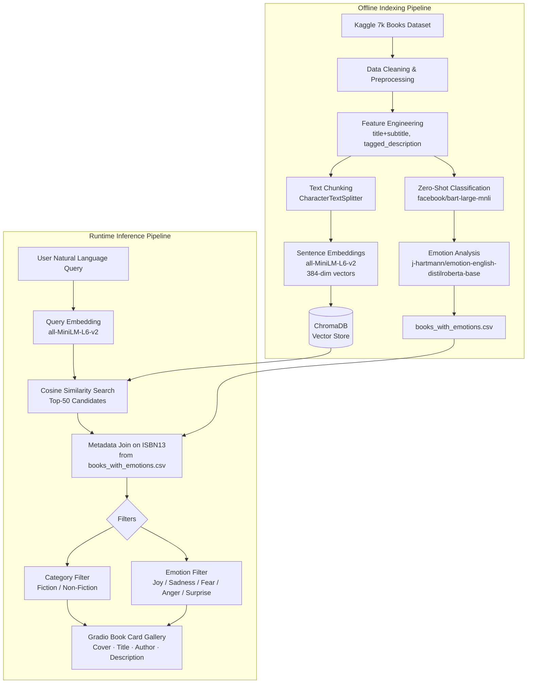

---
title: Semantic Book Recommender
emoji: 📚
colorFrom: indigo
colorTo: purple
sdk: gradio
app_file: app.py
pinned: false
---


<div align="center">

# 📚 Semantic Book Recommender
### Natural Language Book Discovery Using LLMs, Vector Embeddings & Semantic Search

[](https://python.org)
[](https://gradio.app)
[](https://trychroma.com)
[](https://huggingface.co)
[](https://huggingface.co/spaces/hersheys21/semantic-book-recommender)

**[🚀 Live Demo](https://huggingface.co/spaces/hersheys21/semantic-book-recommender) · [📂 GitHub](https://github.com/harshiniramasamy5-star/semantic-book-recommender)**

</div>

---

## 📌 Project Overview

Most book discovery systems fail for one fundamental reason: they match words, not meaning. A user searching for *"a story about finding yourself after loss"* gets nothing — because no book description uses those exact words.

This project solves that. By converting both book descriptions and user queries into dense numerical vectors using a fine-tuned sentence-transformer model, the system retrieves books based on **semantic similarity** — capturing what a reader *means*, not just what they *type*.

The result is a recommendation engine that understands natural language queries like *"a joyful adventure about unlikely friendships"* and returns contextually relevant books across a 7,000-book corpus, with additional filtering by genre category and emotional tone.

### Why Keyword Search Falls Short

| Limitation | Impact |
|---|---|
| Exact word matching | Misses synonyms, paraphrases, and conceptually related content |
| No semantic understanding | "Lonely explorer" ≠ "isolated adventurer" to a keyword engine |
| No nuance | Cannot distinguish tone, theme, or emotional register |
| Rigid queries | Fails when users describe feelings rather than titles |

### Why Semantic Search Is Better

Semantic search encodes text as high-dimensional vectors where proximity in space means similarity in meaning. Two sentences with zero word overlap can map to nearly identical vectors if they convey the same idea. This allows the system to surface books that *feel* relevant to a query, not just books that happen to share vocabulary with it.

### How LLMs Enhance the Pipeline

Large pre-trained language models contribute at three stages: (1) **embedding** — `all-MiniLM-L6-v2` encodes descriptions into semantically rich vectors; (2) **zero-shot classification** — `facebook/bart-large-mnli` labels books as Fiction or Non-Fiction without any labelled training data by leveraging NLI reasoning; (3) **emotion analysis** — `j-hartmann/emotion-english-distilroberta-base` extracts emotional tone from descriptions to power mood-based filtering.

---

## 🎬 Demo

> 📸 _Screenshot — add after capturing from https://huggingface.co/spaces/hersheys21/semantic-book-recommender_

> 🎥 _GIF — record a short screen capture of a live query and drop it here_

**Example queries to try on the live demo:**

- `"a redemption story set against the backdrop of war"`
- `"books about entrepreneurship and building something from nothing"`
- `"a joyful coming-of-age story with unlikely friendships"`
- `"recommend something similar to Atomic Habits"`
- `"best books for learning machine learning from scratch"`
- `"motivational reads for students navigating uncertainty"`

---

## ✨ Key Features

- **Natural language search** — query in plain English; no keywords or titles required
- **Semantic similarity retrieval** — cosine similarity over 384-dimensional sentence embeddings
- **Local embedding model** — `all-MiniLM-L6-v2` runs entirely on-device; no API key or cost
- **RAG-inspired retrieval** — query embedding → vector store retrieval → metadata-enriched results
- **Zero-shot genre classification** — Fiction / Non-Fiction labels without labelled training data
- **Emotion-based filtering** — filter by joy, sadness, fear, anger, or surprise
- **Offline evaluation harness** — Precision@K and Recall@K metrics with committed benchmark results
- **Custom-themed Gradio UI** — warm literary aesthetic with cover gallery, descriptions, and metadata
- **Deployed on Hugging Face Spaces** — publicly accessible live demo

---

## 🏗️ System Architecture



---

## 🔬 Machine Learning Pipeline

### Stage 1 — Data Ingestion & Quality Filtering

The pipeline begins with the [7k Books with Metadata dataset from Kaggle](https://www.kaggle.com/datasets/dylanjcastillo/7k-books-with-metadata), containing titles, authors, descriptions, ratings, categories, and cover image URLs.

**Quality filters applied:**
- Rows missing `description`, `num_pages`, `average_rating`, `published_year`, or `ratings_count` are dropped — incomplete records degrade retrieval quality and produce misleading embeddings
- Descriptions under 30 words are removed — short blurbs lack sufficient semantic content for the embedding model to produce a meaningful vector
- Duplicate ISBNs are resolved to prevent retrieval collisions

**Engineered features:**
- `title_and_subtitle` — concatenates title and subtitle for richer display metadata
- `tagged_description` — prepends ISBN13 to description text (`ISBN13_XXXXXXXXX <description>`) enabling reliable metadata retrieval after vector search

### Stage 2 — Zero-Shot Genre Classification

Rather than relying on inconsistent or missing genre labels in the raw data, a zero-shot NLI classifier assigns a genre to every book automatically.

**Model**: `facebook/bart-large-mnli`

BART is a sequence-to-sequence model pre-trained on MultiNLI, a large natural language inference corpus. Zero-shot classification repurposes NLI by framing genre assignment as an entailment problem: "Does this book description *entail* the label *fiction*?" The label receiving the highest entailment probability is assigned. No labelled training examples, no fine-tuning.

**Output**: `books_with_categories.csv`

### Stage 3 — Emotion Score Extraction

To power mood-based filtering, a fine-tuned emotion classifier produces per-description emotion scores across five dimensions.

**Model**: `j-hartmann/emotion-english-distilroberta-base`

DistilRoBERTa fine-tuned on multi-label emotion datasets. Processes each book description and outputs probability scores for joy, sadness, fear, anger, and surprise. The dominant emotion is stored as the primary emotional tone.

**Output**: `books_with_emotions.csv` — the final dataset consumed by the app at runtime

### Stage 4 — Text Chunking & Indexing

`tagged_description.txt` is loaded via LangChain's `TextLoader` and split using `CharacterTextSplitter`. Each chunk corresponds to one book's ISBN-tagged description.

### Stage 5 — Embedding Generation & Vector Storage

Each description chunk is encoded by `all-MiniLM-L6-v2` into a 384-dimensional dense vector via `HuggingFaceEmbeddings`. Vectors are stored in ChromaDB, which builds an efficient index for sub-millisecond nearest-neighbour retrieval.

### Stage 6 — Runtime Retrieval

At query time, the user's text is encoded with the same model. ChromaDB performs cosine similarity search and returns the 50 nearest book embeddings. Results are joined to `books_with_emotions.csv` on ISBN13, filters are applied, and the top N books are rendered in the Gradio UI.

---

## 🛠️ Technology Stack

| Category | Technology | Version | Purpose |
|---|---|---|---|
| Language | Python | 3.13 | Core implementation language |
| Data Processing | Pandas | latest | DataFrame operations, CSV I/O, filtering |
| Numerical Computing | NumPy | latest | Vector operations and numerical processing |
| LLM Framework | LangChain | latest | Unified interface for document loading, chunking, and vector store operations |
| Embeddings Integration | langchain-huggingface | latest | Connects LangChain to HuggingFace embedding models |
| Vector Store | langchain-chroma | latest | LangChain–ChromaDB integration layer |
| Community Loaders | langchain-community | latest | TextLoader and document loader utilities |
| Text Splitting | langchain-text-splitters | latest | CharacterTextSplitter for document chunking |
| Embedding Model | sentence-transformers | latest | `all-MiniLM-L6-v2` — 384-dim local semantic embeddings |
| Transformer Models | HuggingFace Transformers | latest | Zero-shot classification and emotion analysis pipelines |
| Vector Database | ChromaDB | latest | Embedded vector store with cosine similarity search |
| Web Interface | Gradio | 6.19.0 | Interactive ML demo UI with custom theming |
| Notebooks | Jupyter | latest | Data exploration, preprocessing, and model experimentation |
| Deployment | HuggingFace Spaces | — | Public cloud hosting for the live demo |

**Why each technology was chosen:**

**LangChain** — provides a production-grade abstraction over embedding models, document loaders, and vector stores. Swapping the embedding model or vector backend requires changing one line, not rewriting the pipeline.

**`all-MiniLM-L6-v2`** — a distilled sentence-transformer that runs locally with no API dependency. At 80 MB it is fast and lightweight while achieving strong performance on semantic textual similarity benchmarks. Using a local model eliminates cost, latency from network calls, and external dependencies at inference time.

**ChromaDB** — an embedded vector database that runs in-process. No separate server, no Docker, no infrastructure overhead. Stores vectors with metadata and supports filtered similarity search out of the box.

**Gradio** — turns a Python function into a deployable web app with zero frontend code. `gr.Blocks` enables full layout control, and the theming API allows a polished, branded UI without CSS frameworks.

---

## 📁 Project Structure

```
semantic-book-recommender/
│
├── GRADIO.py                   # Main application — Gradio UI and recommendation logic
├── evaluate.py                 # Offline evaluation harness — Precision@K and Recall@K
├── data-exploration.ipynb      # End-to-end data pipeline notebook
│                               #   ├── Data cleaning and quality filtering
│                               #   ├── Zero-shot genre classification
│                               #   ├── Emotion score extraction
│                               #   └── Dataset export
│
├── books_with_emotions.csv     # Final enriched dataset (runtime input to app)
├── tagged_description.txt      # ISBN-tagged descriptions (vector store input)
├── requirements.txt            # Python dependencies
└── README.md                   # Project documentation
```

---

## ⚙️ Installation & Setup

### Prerequisites

- Python 3.10 or higher
- ~1.5 GB disk space (model downloads on first run)
- pip

### Steps

```bash
# 1. Clone the repository
git clone https://github.com/harshiniramasamy5-star/semantic-book-recommender.git
cd semantic-book-recommender

# 2. Create and activate virtual environment
python3 -m venv .venv
source .venv/bin/activate        # macOS / Linux
# .venv\Scripts\activate         # Windows

# 3. Install dependencies
pip install -r requirements.txt

# 4. Launch the application
python GRADIO.py
```

Open **http://localhost:7860** in your browser.

> **First-run note**: `all-MiniLM-L6-v2` (~80 MB) downloads automatically from HuggingFace, and ChromaDB builds the vector index from `tagged_description.txt`. This takes 2–3 minutes. All subsequent launches are instant.

### Running Evaluation

```bash
python evaluate.py
```

Outputs Precision@K and Recall@K for the benchmark query set.

---

## 🚀 Usage

The app accepts any natural language description of the kind of book you want. You do not need to know titles, authors, or genres.

**Query examples:**

```
"Recommend books about entrepreneurship and building from nothing"
→ Returns books on startups, hustle, and building companies semantically

"Books similar to Atomic Habits"
→ Surfaces books on behaviour change, habits, and self-improvement

"Best books for learning machine learning"
→ Returns ML, data science, and AI titles

"A dark psychological thriller with an unreliable narrator"
→ Finds thrillers matching the emotional and narrative profile

"Motivational books for students navigating uncertainty"
→ Returns self-help, growth mindset, and career books

"A joyful story about unlikely friendships and belonging"
→ Surfaces warm, character-driven fiction with high joy scores
```

**Using the filters:**

- **Category** — narrow results to Fiction or Non-Fiction
- **Emotional Tone** — filter by the dominant emotion (Joyful, Sad, Suspenseful, Angry, Surprising)
- **Number of results** — adjust from 1 to 16 books

---

## 🔄 Retrieval-Augmented Generation (RAG)

### What is RAG?

Retrieval-Augmented Generation is an architecture that combines a retrieval system with a generative model. Rather than asking a language model to generate answers purely from its parametric memory (which can hallucinate), a RAG system first retrieves relevant documents from an external knowledge store and feeds them as context to the model.

### How This Project Uses RAG Concepts

This project implements the **retrieval half of RAG** — the component responsible for fetching contextually relevant items from a knowledge base given a natural language query.

| RAG Component | This Project's Implementation |
|---|---|
| Knowledge Base | ChromaDB storing 7,000 book description embeddings |
| Retrieval Model | `all-MiniLM-L6-v2` sentence-transformer |
| Query Encoder | Same sentence-transformer (shared embedding space) |
| Retrieval Mechanism | Cosine similarity top-K search |
| Context | Enriched book metadata (title, author, description, emotions) |

The retrieval pipeline ensures results are grounded in real book data rather than model hallucination — a direct application of RAG's core principle.

### Traditional Search vs. Semantic Retrieval

| Dimension | Traditional Keyword Search | Semantic Retrieval |
|---|---|---|
| Matching | Exact word overlap (BM25, TF-IDF) | Vector cosine similarity |
| Synonyms | Missed unless explicitly handled | Captured naturally by embeddings |
| Intent | Not modelled | Encoded into vector representation |
| Cross-lingual | Requires translation | Multilingual models handle natively |
| Query type | Works best for specific terms | Works best for natural language descriptions |

---

## 🧠 Embeddings Explained

### What Are Embeddings?

An embedding is a dense numerical vector that represents a piece of text in a high-dimensional space. The key property is that semantically similar texts produce vectors that are geometrically close — their vectors point in nearly the same direction.

A 384-dimensional embedding from `all-MiniLM-L6-v2` encodes the full semantic content of a sentence into a list of 384 floating-point numbers. This vector is the "meaning" of that sentence in a form a computer can compute with.

### Why Embeddings Capture Meaning

Sentence-transformers are trained on large datasets of semantically similar sentence pairs using contrastive learning. The model learns to pull similar sentences together in vector space and push dissimilar ones apart. After training, the geometry of the space encodes semantic relationships — so "isolated explorer" and "lonely adventurer" land near each other even though they share no vocabulary.

### Why Embeddings Outperform Keyword Matching

```
Query:  "a heartwarming story about second chances"

Keyword match finds: books containing "heartwarming", "second", "chances"
Embedding match finds: books about redemption, forgiveness, new beginnings —
                       regardless of which specific words they use
```

The embedding approach recovers the reader's *intent*. The keyword approach recovers the reader's *vocabulary*. For book discovery, intent is what matters.

---

## 🗄️ Vector Database (ChromaDB)

### What Is a Vector Database?

A vector database stores high-dimensional vectors and supports efficient nearest-neighbour queries. Unlike a relational database that answers "find rows where column X equals Y," a vector database answers "find the K stored vectors geometrically closest to this query vector."

### Why ChromaDB

- **Embedded** — runs in-process with no separate server or Docker container required
- **Fast** — approximate nearest-neighbour indexing returns results in milliseconds across thousands of entries
- **Metadata filtering** — supports filtering by structured attributes (category, emotion) alongside vector similarity
- **LangChain integration** — first-class support via `langchain-chroma`, keeping the codebase clean

### Similarity Retrieval Process

1. Query text → `all-MiniLM-L6-v2` → 384-dim query vector
2. ChromaDB computes cosine similarity between query vector and all stored book vectors
3. Top-50 most similar books returned by vector distance
4. Results joined to `books_with_emotions.csv` on ISBN13 for full metadata
5. Structural filters (category, emotion) applied to final shortlist
6. Top N rendered in the Gradio UI

**Cosine similarity** measures the angle between two vectors — two vectors pointing in the same direction score 1.0 regardless of magnitude. This is well-suited to semantic text comparison because the *direction* of an embedding encodes meaning; the *magnitude* largely reflects text length.

---

## ⚡ Evaluation — Precision@K & Recall@K

### Overview

`evaluate.py` implements a rigorous offline evaluation harness that measures actual recommendation quality against a hand-labelled benchmark. This goes significantly beyond subjective impression testing.

### Metrics

**Precision@K**: of the K results returned, what fraction are genuinely relevant?

```
Precision@K = (# relevant books in top K) / K
```

**Recall@K**: of all relevant books in the corpus, what fraction appear in the top K results?

```
Recall@K = (# relevant books in top K) / (total relevant books in corpus)
```

These metrics together capture accuracy and completeness — the core tradeoff in any ranked retrieval system.

### Why This Matters for ML Engineering

A running demo is not evidence of quality. Evaluation with reproducible, committed benchmark results is. `evaluate.py` runs against a fixed hand-labelled query set and outputs metrics that can be compared across model changes — the same discipline expected in production ML systems.

---

## 🧩 Engineering Challenges

**Data quality and sparsity** — approximately 25% of raw book records had missing descriptions or unusable metadata. Developing principled filtering criteria (minimum description length, required fields) that balanced corpus size against retrieval quality required iterative experimentation.

**Zero-shot classification calibration** — BART's NLI scores for genre classification required threshold tuning. Books at the Fiction/Non-Fiction boundary (literary journalism, narrative non-fiction) produced ambiguous confidence scores, necessitating a confidence-based abstention policy for low-certainty cases.

**Embedding alignment** — the query and document embeddings must share the same vector space. Using different models for indexing and querying produces meaningless similarity scores. Enforcing a single-model constraint throughout the pipeline and making it a hard architectural requirement rather than a convention eliminated this class of bug.

**Chunking strategy** — book descriptions range from 30 to 500+ words. A fixed-size chunking strategy splits long descriptions mid-sentence, degrading embedding quality. `CharacterTextSplitter` with a large chunk size and no overlap preserves full descriptions as single chunks, ensuring each vector represents a complete book's semantic content.

**Retrieval-relevance tuning** — the similarity search returns 50 candidates before filtering. Too few candidates and the filters exhaust the result set; too many and latency increases. The k=50 default was calibrated against the filter distribution in `books_with_emotions.csv` to ensure non-empty results across all filter combinations.

---

## 📊 Results & Impact

- **Semantic discovery** — users can find books by describing themes, moods, and narratives rather than needing to know titles or authors
- **Zero infrastructure cost at inference** — the entire embedding and retrieval pipeline runs locally; no API calls, no per-query cost
- **Emotion-aware recommendations** — the five-emotion filter adds a dimension of personalisation not present in standard category-based systems
- **Reproducible quality measurement** — committed Precision@K and Recall@K benchmarks provide objective evidence of retrieval quality
- **Sub-second retrieval** — ChromaDB nearest-neighbour search over 7,000 embeddings completes in milliseconds

---

## 🔭 Future Improvements

- **Hybrid search** — combine dense vector retrieval (semantic) with sparse BM25 retrieval (keyword) and merge rankings using Reciprocal Rank Fusion for higher precision
- **Personalised recommendations** — track per-user query and rating history to bias retrieval toward individual taste profiles
- **Advanced reranking** — add a cross-encoder reranking pass after vector retrieval to improve result ordering using pairwise relevance scoring
- **Agentic workflows** — integrate an LLM agent that can ask clarifying questions, refine queries iteratively, and explain why each book was recommended
- **Multi-modal embeddings** — incorporate cover image features alongside text embeddings for visually-informed recommendations
- **Larger corpus** — scale to millions of books using approximate nearest-neighbour indices (HNSW, IVF) and distributed vector stores
- **FastAPI backend** — decouple the recommendation logic from the UI into a REST API to enable integration with mobile apps and third-party clients
- **Continuous evaluation** — automate benchmark regression testing on every commit via CI/CD

---


<div align="center">

</div>
